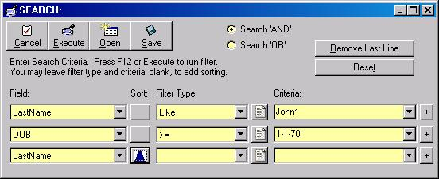



## SEARCHER

### Description

This is a screen that will allow you to do searches for anything. It uses control arrays, so you can keep adding search/sort criteria.

Keep in mind that I was actually passing field objects to manage the various drop-downs, so you'll have to incorporate your own data access techniques.

I had to strip out some things, because it dealt with my own Interface classes, but it should at least give you some ideas. If you use this, PLEASE VOTE. Email me @ paulbrower@browerconsulting.com if you have questions/comments.
 
### More Info
 

             |
---                |---
**Submitted On**   |2001-02-16 06:32:42
**By**             |[Paul Brower](https://github.com/Planet-Source-Code/PSCIndex/blob/master/ByAuthor/paul-brower.md)
**Level**          |Intermediate
**User Rating**    |4.0 (8 globes from 2 users)
**Compatibility**  |VB 5\.0, VB 6\.0
**Category**       |[Custom Controls/ Forms/  Menus](https://github.com/Planet-Source-Code/PSCIndex/blob/master/ByCategory/custom-controls-forms-menus__1-4.md)
**World**          |[Visual Basic](https://github.com/Planet-Source-Code/PSCIndex/blob/master/ByWorld/visual-basic.md)
**Archive File**   |[CODE\_UPLOAD150512162001\.zip](https://github.com/Planet-Source-Code/paul-brower-searcher__1-21060/archive/master.zip)

